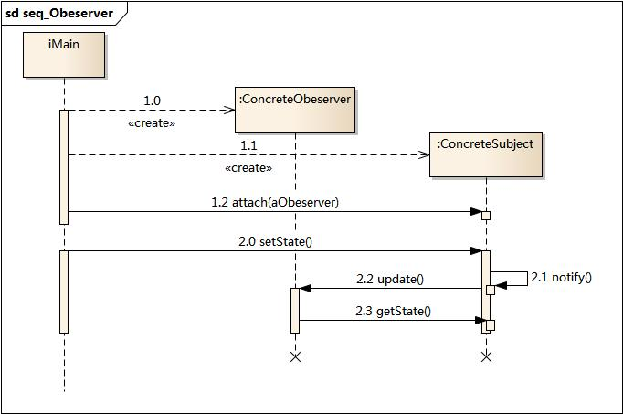
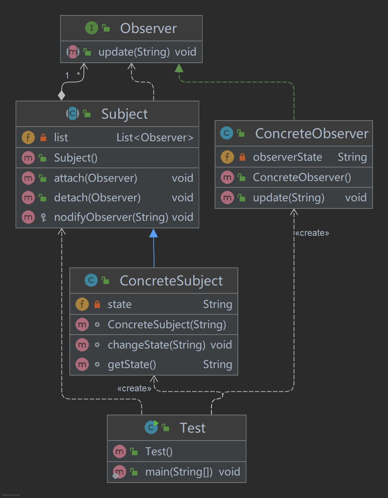
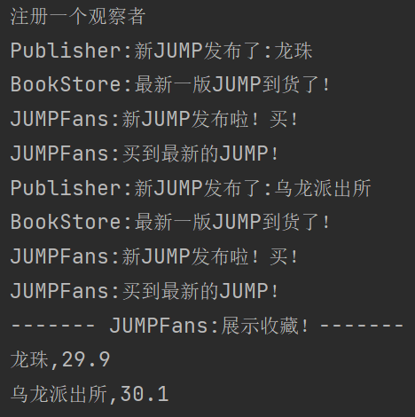
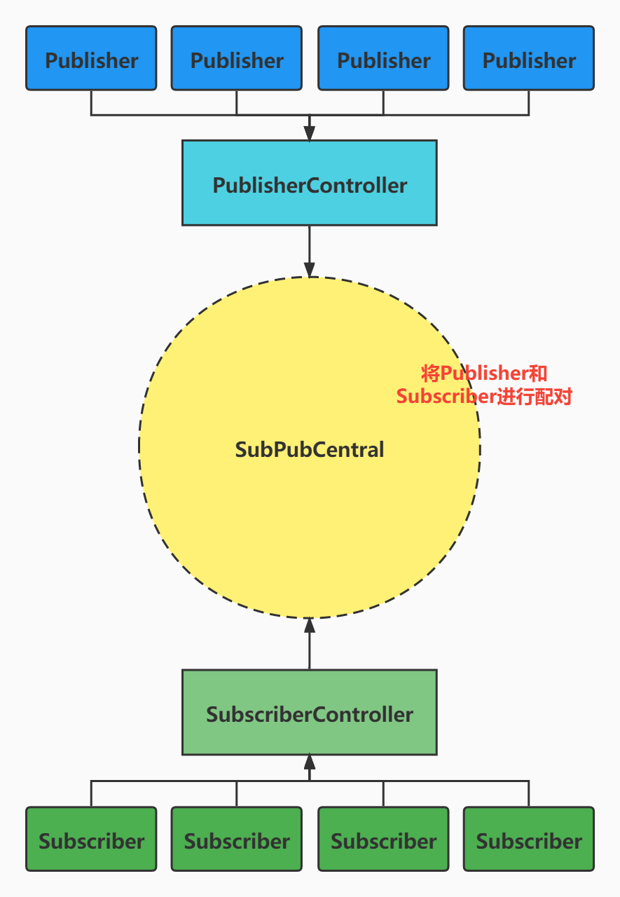
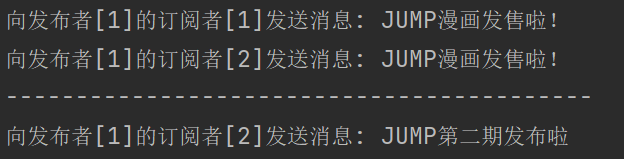
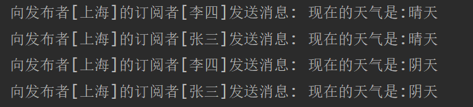

# 发布订阅模式 VS 观察者模式

## 观察者模式

### 1.1.简介

> 观察者模式定义了一种一对多的依赖关系，让多个观察者同时监听某一主题对象。
>
> 这个主题对象在状态发生变化时，会通知所有观察者对象，让他们自动更新自己的状态。

### 1.2.模式结构

观察者模式包含如下角色

- Subject：主题
- ConcreteSubject：具体主题实现
- Observer：观察者
- ConcreteObserver：观察者实现


时序图



### 1.3.代码实现例子
- 类图




- Main方法执行

```java
public static void main(String[] args) {
    ConcreteObserver concreteObserver1 = new ConcreteObserver();
    ConcreteObserver concreteObserver2 = new ConcreteObserver();
    ConcreteSubject concreteSubject = new ConcreteSubject("星空");
    //注册观察者
    concreteSubject.attach(concreteObserver1);
    concreteSubject.attach(concreteObserver2);
    //主题发生变化
    concreteSubject.changeState("世界");
}
```

- Subject主题，抽象类

```java
public abstract class Subject {
    /**
     * 用来保存注册的观察者对象
     */
    private List<Observer> list = new ArrayList<Observer>();

    /**
     * 注册观察者对象
     * @param observer 观察者对象
     */
    public void attach(Observer observer){
        list.add(observer);
        System.out.println("注册一个观察者");
    }

    /**
     * 删除观察者对象
     */
    public void detach(Observer observer){
        list.remove(observer);
    }

    /**
     * 通知所有注册的观察者对象
     */
    protected void nodifyObserver(String newState){
        for (Observer observer : list) {
            observer.update(newState);
        }
    }
}
```

- ConcreteSubject 主题实现子类

```java
public class ConcreteSubject extends Subject {
    private String state;

    ConcreteSubject(String state){
        this.state = state;
        System.out.println("这次的主题是:"+state);
    }

    String getState(){
        return state;
    }

    void changeState(String newState){
        this.state = newState;
        System.out.println("主题发生变更，变更为:"+ state);
        this.nodifyObserver(newState);
    }

}
```

- Observer观察者接口

```java
public interface Observer {
    /**
     * 更新接口
     * @param state 更新状态
     */
    void update(String state);

}
```

- ConcreteObserver 观察者实现类

```java
public class ConcreteObserver implements Observer {
    /**
     * 更新观察者状态和主题同步
     * @param state 更新状态
     */

    private String observerState;

    @Override
    public void update(String state) {
        this.observerState = state;
        System.out.println("观察者状态更新为:"+state);
    }
}
```

### 1.4.实现一个JUMP漫画发布和粉丝购买例子

> 使用观察者模式实现的一个JUMP粉丝，观察JUMP出版商官网更新状态，去买JUMP书

角色:

- JUMPPublisher：jump出版商
- BookStore：jump出版商的经销商，出版商主动将书卖给书店
- JUMPFans：jump粉丝
- JUMP：书

JUMP.java

```java
@Data
public class JUMP {
    private String name;
    private Double price;
}
```

BookStore.java

```java
public class BookStore  {

    private JUMP jump;

    /**
     * 卖出
     * @return
     */
    public JUMP sell() {
        return jump;
    }

    /**
     * 进货
     * @param jump
     */
    public void setJump(JUMP jump) {
        System.out.println("BookStore:最新一版JUMP到货了！");
        this.jump = jump;
    }
}

```

JUMPFans.java

```java
public class JUMPFans implements Observer {

    /**
     * JUMP书迷的JUMP漫画收藏夹
     */
    private List<JUMP> JUMPlist = new ArrayList<>();

    /**
     * 世界唯一一家书店
     */
    private BookStore bookStore;

    JUMPFans(BookStore bookStore){
        this.bookStore = bookStore;
    }

    @Override
    public void update(String state) {
        System.out.println("JUMPFans:新JUMP发布啦！买！");
        this.buy();
    }

    private void buy() {
        JUMP jump = bookStore.sell();
        System.out.println("JUMPFans:买到最新的JUMP！");
        JUMPlist.add(jump);
    }

    /**
     * 展示一下收藏
     */
    void showList(){
        System.out.println("------- JUMPFans:展示收藏！-------");
        for (JUMP jump : JUMPlist) {
            System.out.println(jump.getName()+","+jump.getPrice());
        }
    }
}

```

JUMPPublisher.java

```java
public class JUMPPublisher extends Subject {
    private JUMP jump;

    private BookStore bookStore;

    /**
     * 确定分销商
     * @param bookStore
     */
    JUMPPublisher(BookStore bookStore){
        this.bookStore = bookStore;
    }

    void publisherNewJUMP(JUMP newJUMP){
        this.jump = newJUMP;
        System.out.println("Publisher:新JUMP发布了:"+newJUMP.getName());
        bookStore.setJump(newJUMP);
        nodifyObserver(jump.getName());
    }

    JUMP getJUMP(){
        return jump;
    }

}
```

Test

```java
public static void main(String[] args) {
        //1.全世界唯一一家JUMP书店开张了
        BookStore bookStore = new BookStore();
        //2.JUMP出版商
        JUMPPublisher jumpPublisher = new JUMPPublisher(bookStore);
        //3.JUMP粉丝
        JUMPFans jumpFans = new JUMPFans(bookStore);
        //4.JUMP粉丝关注JUMP出版商官网，观察JUMP书最新动态
        jumpPublisher.attach(jumpFans);
        //5.第一期JUMP
        JUMP jump1 = new JUMP("龙珠",29.9);
        //6.出版商发布JUMP
        jumpPublisher.publisherNewJUMP(jump1);
        //7.第二期JUMP
        JUMP jump2 = new JUMP("乌龙派出所",30.1);
        //8.出版商发布新JUMP
        jumpPublisher.publisherNewJUMP(jump2);
        //9.粉丝展示自己的收藏
        jumpFans.showList();
}
```

结果：


## 发布-订阅模式

### 2.1.简介

> 发布订阅模式（Pub-Sub Pattern），发布订阅模式中，发布者的消息不会直接发送给订阅者，这意味者发布者和订阅者都不知道彼此的存在。**在发布者和订阅者之间存在第三个组件，称为消息代理或调度中心或中间件，位置发布者和订阅者之间的关系。**

### 2.2.结构

- 发布者，订阅者对象
  - Publisher：发布者
  - Subscriber：订阅者
- 发布者，订阅者动作控制器
  - PublisherController：发布者控制器
  - SubscriberController：订阅者控制器
- 发布者订阅者调度中心：
  - SubPubCentral：调度中心

结构图



### 2.3.代码示例

Publisher

```java
@Data
public class Publisher {
    private Integer id;  //唯一。每个发布者的id都不相同
}
```

Subscriber

```java
@Data
public class Subscriber {
    private Integer id;  //唯一。每个发布者的id都不相同
}
```

PublisherController

```java
public class PublisherController {
    private SubPubCentral subPubCentral;  //订阅发布中心。

    public PublisherController(SubPubCentral subPubCentral) {
        this.subPubCentral = subPubCentral;
    }

    /**
     * @=-= 发布数据，假设前端传递的是一个id对象和一个内容对象。简单化，实际上会传递一个包装数据过来.
     * @param publisherId
     * @param message
     */
    public void publish(Integer publisherId,String message){
        subPubCentral.publish(new Publisher(publisherId),message);
    }
}
```

SubscriberController

```java
public class SubscriberController {

    private SubPubCentral subPubCentral;

    public SubscriberController(SubPubCentral subPubCentral) {
        this.subPubCentral = subPubCentral;
    }

    public void subscribe(Integer subscriberId,Integer publisherId){
        subPubCentral.subscribe(new Publisher(publisherId),new Subscriber(subscriberId));
    }

    public void unsubscribe(Integer subscriberId,Integer publisherId){
        subPubCentral.unsubscribe(new Publisher(publisherId),new Subscriber(subscriberId));
    }

}
```

SubPubCentral

```java
public interface SubPubCentral {

    boolean subscribe(Publisher publisher, Subscriber subscriber);

    boolean unsubscribe(Publisher publisher, Subscriber subscriber);

    void publish(Publisher publisher, String message);

}
```

SubPubCentralImpl

```java
public class SubPubCentralImpl implements SubPubCentral {
    private static Map<Integer, Set<Integer>> PubSubMap ;  //存放所有的发布者的对应订阅者。

    static{
        PubSubMap = new HashMap<>();
    }

    @Override
    public boolean subscribe(Publisher publisher, Subscriber subscriber) {

        try{
            Set<Integer>  subscriberSet = PubSubMap.get(publisher.getId()); //拿到当前发布者的所有订阅者
            if(subscriberSet == null)  //为空，之前不存在订阅者
                subscriberSet = new HashSet<>();
            boolean added = subscriberSet.add(subscriber.getId()); //添加订阅者
            if(added)  //添加订阅者成功。
                return PubSubMap.put(publisher.getId(),subscriberSet) != null;
            return false;  //订阅者添加失败或者该订阅之前则订阅了发布者
        }catch(Exception e){
            e.printStackTrace();
        }
        return false;
    }

    @Override
    public boolean unsubscribe(Publisher publisher, Subscriber subscriber) {

        try{
            Set<Integer>  subscriberSet = PubSubMap.get(publisher.getId());
            if(subscriberSet == null)
                return false;
            boolean removed = subscriberSet.remove(subscriber.getId());       //删除取消订阅者
            if(removed)
                PubSubMap.put(publisher.getId(),subscriberSet); //更新订阅者列表
            return removed;
        }catch (Exception e){
            e.printStackTrace();
        }

        return false;
    }

    @Override
    public void publish(Publisher publisher, String message) {

        Set<Integer> subscriberSet =  PubSubMap.get(publisher.getId());

        //遍历订阅者发送消息。 此处简单实现： 只需要打印出拿到的所有订阅者即可
        for (Integer subscriber : subscriberSet) {
            System.out.println("向发布者[" + publisher.getId()
                    +"]的订阅者[" + subscriber + "]发送消息: " +  message);
        }
    }
}
```

Main方法

```java
 public static void main(String[] args) {
        //1.创建发布者，订阅者调度中心
        SubPubCentral subPubCentral =  new SubPubCentralImpl();
        //2.创建发布者，订阅者
        PublisherController publisherController = new PublisherController(subPubCentral);
        SubscriberController subscriberController = new SubscriberController(subPubCentral);
        //3.调度中心，注册发布者和对应的订阅者
        subscriberController.subscribe(1,1);
        subscriberController.subscribe(2,1);
        //4.发布者发布消息
        publisherController.publish(1,"JUMP漫画发售啦！");
        System.out.println("------------------------------------------");
        //5.移除订阅者测试
        subscriberController.unsubscribe(1,1);
        publisherController.publish(1,"JUMP第二期发布啦");
    }
```

结果


### 2.4.天气站模拟发布-订阅模式

> 通过气象站定时发送现在的天气，用户订阅天气站，接收天气站发送的天气信息，两者互相不了解，通过第三方平台帮你定制天气。

- entity
  - Station
  - User
- controller
  - StationContorller
  - UserContorller
- WhetherCentral
- Main

Station

```java
@Data
public class Station {
    private Integer id;
    private String place;
}
```

User

```java
@Data
public class Station {
    private Integer id;
    private String name;
}
```

StationController

```java
public class StationController {

    private WhetherCentral whetherCentral;

    public StationController(WhetherCentral whetherCentral) {
        this.whetherCentral = whetherCentral;
    }

    public void publish(Station station, String whetherMsg) {
        whetherCentral.publish(station, whetherMsg);
    }
}
```

UserController

```java
public class UserController {
    private WhetherCentral whetherCentral;

    public UserController(WhetherCentral whetherCentral){
        this.whetherCentral = whetherCentral;
    }

    public void subscribe(Station station, User user){
        whetherCentral.subscribe(station,user);
    }

    public void unsubscribe(Station station, User user){
        whetherCentral.unsubscribe(station, user);
    }
}
```

WhetherCentral

```java
public interface WhetherCentral {

    boolean subscribe(Station station, User user);

    boolean unsubscribe(Station station, User user);

    void publish(Station station, String whetherMsg);

}
```

WhetherCentralImpl

```java
public class WhetherCentralImpl implements WhetherCentral {
    private static Map<Station, Set<User>> PubSubMap;  //存放所有的发布者的对应订阅者。

    static{
        PubSubMap = new HashMap<>();
    }


    @Override
    public boolean subscribe(Station station, User user) {
        try {
            //1.拿到当前气象站所有订阅者名单
            Set<User> userSet = PubSubMap.get(station);
            if (userSet == null){
                //订阅者为空，则该气象站还没有订阅者，则创建一个订阅者
                userSet = new HashSet<>();
            }
            //2.添加添加用户订阅当前气象站
            boolean add = userSet.add(user);
            //3.判断是否添加成功
            if (add){
                return PubSubMap.put(station, userSet) != null;
            }else {
                System.out.println("添加失败");
            }
        }catch (Exception e){
            e.printStackTrace();
        }finally {
            return false;
        }
    }

    @Override
    public boolean unsubscribe(Station station, User user) {
        try {
            //1.取出订阅者集合
            Set<User> userSet = PubSubMap.get(station);
            //2.判断订阅者是否为空
            if (userSet != null){
                boolean remove = userSet.remove(user);
                if (remove) {
                    return PubSubMap.put(station,userSet) != null;
                }else {
                    System.out.println("没有该订阅者");
                }
            }
        }catch (Exception e){
            e.printStackTrace();
        }finally {
            return false;
        }
    }

    @Override
    public void publish(Station station, String whetherMsg) {
        //1.获取订阅者
        Set<User> userSet = PubSubMap.get(station);
        for (User user : userSet) {
            System.out.println("向发布者[" + station.getPlace()
                    +"]的订阅者[" + user.getName() + "]发送消息: " + "现在的天气是:" + whetherMsg);
        }
    }
}
```

Main

```java
public static void main(String[] args) {
    //1.创建气象站
    Station station = new Station(1,"上海");
    //2.创建多个用户
    User user1 = new User(1,"张三");
    User user2 = new User(2,"李四");
    //3.创建控制器
    WhetherCentralImpl wci = new WhetherCentralImpl();
    StationController sc = new StationController(wci);
    UserController uc = new UserController(wci);
    //4.用户关注气象站
    uc.subscribe(station,user1);
    uc.subscribe(station,user2);
    //5.气象站发布最新天气信息
    sc.publish(station,"晴天");
    sc.publish(station,"阴天");
}
```

结果：


